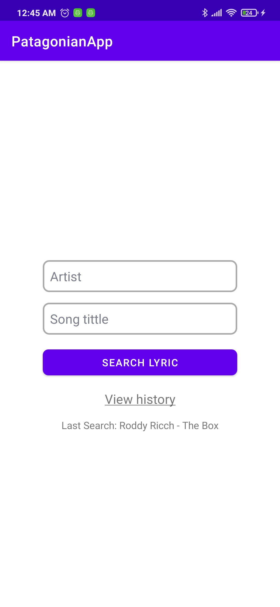
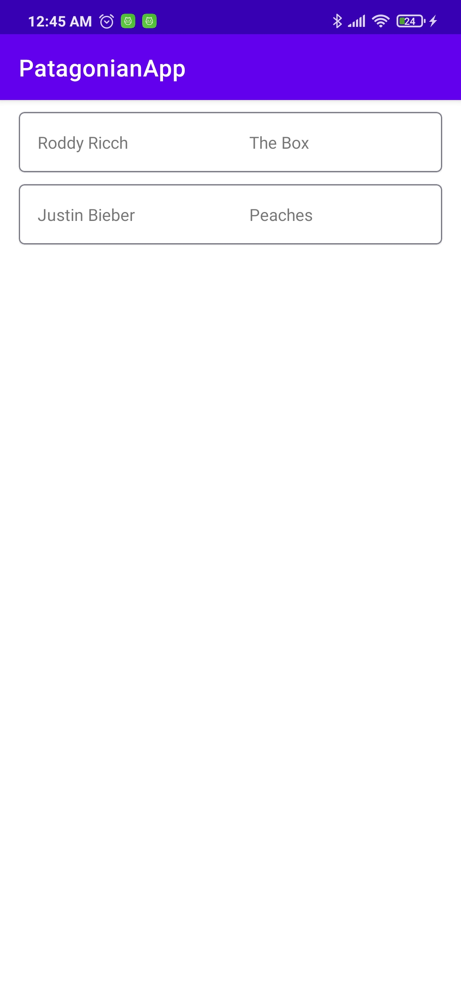
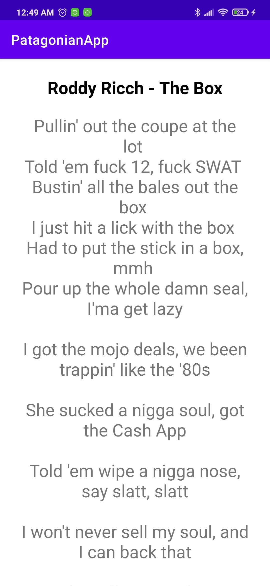

# PatagonianApp
Éste es el proyecto prueba de Patagonian, con esta app se puede buscar la letra de una canción, ingresando el artista y título de ésta.

# Experiencia de usuario
Este proyecto contiene las siguientes características:

* Una pantalla de inicio con las siguientes opciones:
  * Campos para ingresar el artista y el título de la canción (ambos campos son obligatiorios) y seguidos de un botón que te lleva a una nueva vista que muestra la letra de la canción.
  * Luego tenemos un texto que al presionarlo nos redirecciona a una visual donde podemos ver todas las búsquedas realizadas.
  * Por último se muestra la última canción que fue búscada, si no hizo ninguna este campo se oculta.
* Una pantalla donde podemos visualizar todas las canciones buscadas y al presionar alguna nos redirecciona a la visual que muestra la letra.
* Una pantalla donde se visualiza la letra de la canción

# Capturas de pantalla

  
  
  

## Guía de implementación

### Trabajo con una API externa que me devuelve las letras, la documentación está en https://lyricsovh.docs.apiary.io/

### Arquitectura

Este proyecto implementa el patrón de arquitectura MVVM y sigue buenas prácticas de Clean Architecture para hacer un código más independiente, mantenible y sencillo.

#### Capas

* UI: Fragments y Activities
* Data: contiene la implementación del repositorio y los sources donde se conecta con room y la api
* Domain: contiene los casos de uso y la definición del repositorio

Este proyecto usa ViewModel para almacenar y manejar datos, así como comunicar cambios hacia la vista.

### Administrador de solicitudes: Retrofit

Este proyecto utiliza Retrofit para mostrar la letra de cada canción desde una API.

### Inyección de dependencia - Koin

Este proyecto utiliza Koin para gestionar la inyección de dependencia.
